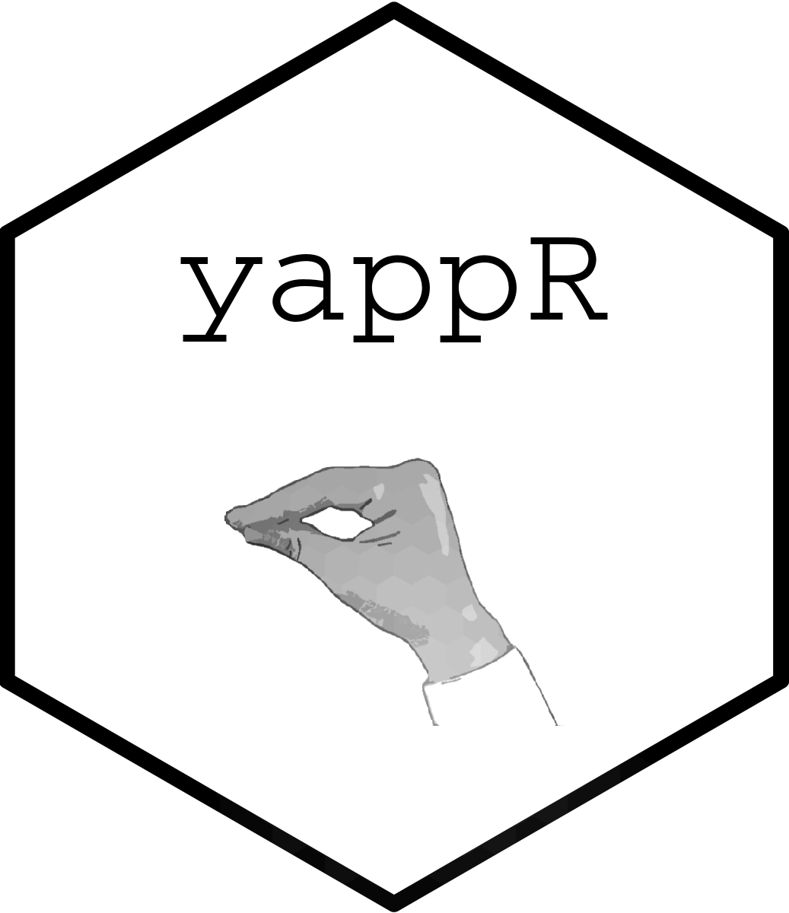

# yappR 
An R Wrapper for YAP API

## Download and install
`remotes::install_github("almogsi/yappr")`

## How to use
This a wrapper for YAP API. You should get you own API token from:
https://nlp.biu.ac.il/~rtsarfaty/onlp/hebrew/about or https://www.langndata.com/heb_parser/register

Then use:
```
text <- "גנן גידל דגן בגן"

token <- "YourAPIToken"

yap_list <- yap(text, token)


yap_lemmas(yap_list) #get lemmas

dep_conll(yap_list) #get CoNLL style dependency tree

dep_lattice(yap_list) #get Lattice style dependency tree
```

## Who did the real work:

More, A., Seker, A., Basmova, V., & Tsarfaty, R. (2019). Joint transition-based models for morpho-syntactic parsing: Parsing strategies for MRLs and a case study from modern Hebrew. Transactions of the Association for Computational Linguistics, 7, 33-48.
